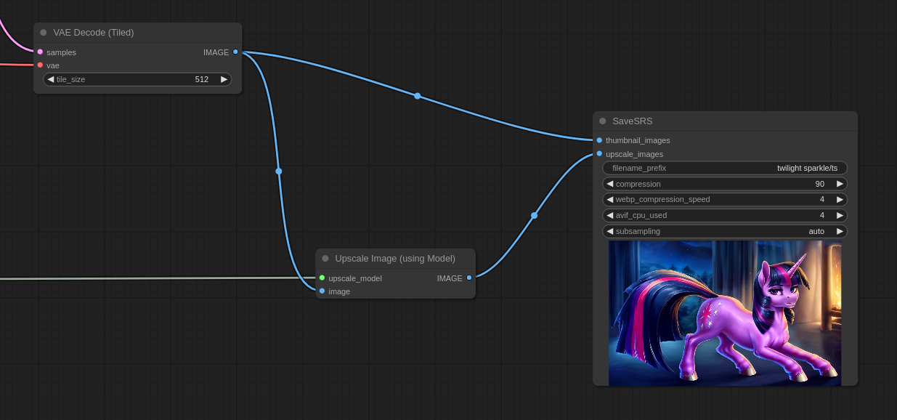

# ComfyUI-SaveSRS 

Save a same picture with multiple representations. ".srs" file format is a part of [ACLMMP](https://github.com/mfg637/ACLMMP) project.

This is a fork from [ComfyUI-Saveaswebp](https://github.com/Kaharos94/ComfyUI-Saveaswebp).
Thank you, Kaharos94.

Currently, this node generates 2 variants of image: avif for upscale image and webp for small sized images.

Actual code for save webp files almost the same as in original node. It even saves metadata in webp.

But not in avif. Instead, metadata stored in .srs files, as well as workflow loading.

Lossless mode was removed. If you need lossless, save as PNG or install Saveaswebp node instead.

## System requirements

This node requires the [libavif](https://github.com/AOMediaCodec/libavif) tools to be installed in your system.

## Installation: 

1. Properly install libavif with tools/apps (node uses only avifenc).
2. Use git clone https://github.com/mfg637/ComfyUI-SaveSRS.git in your ComfyUI custom nodes directory.